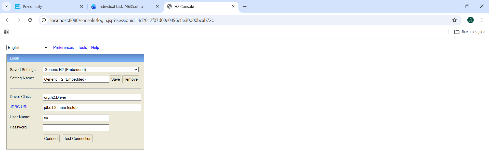
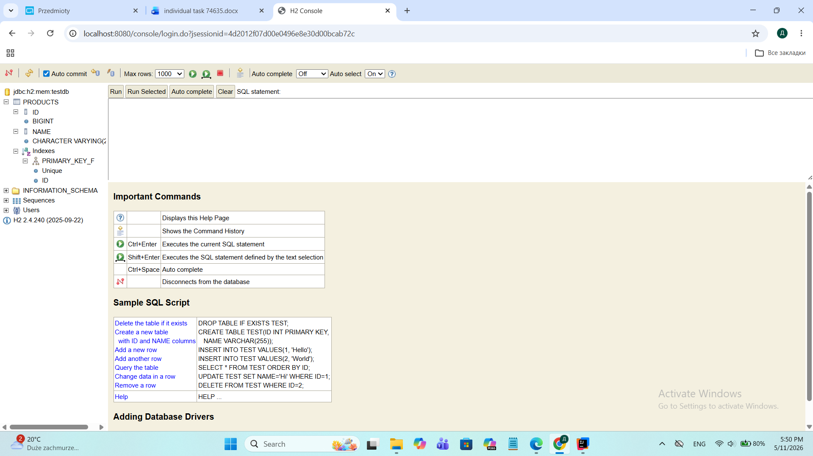
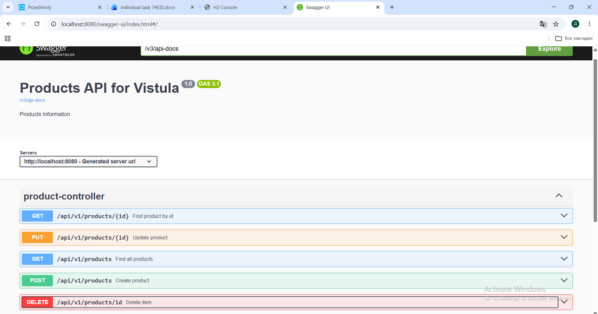

## Project Description

This project is a REST API application created using Spring Boot. Designed to manage a product catalog. This project demonstrates a clean 3-tier architecture (Controller, Service, Repository) using Spring Data JPA and an H2 in-memory database.

The application supports:

- creating products,
- getting product by ID,
- getting all products,
- updating product,
- deleting product,
- exception handling,
- Swagger UI documentation,
- H2 database integration,
- Spring Data JPA.


## Project Screenshots

### 1. User Authentication (Login)
The application is secured with Spring Security. Below is the login interface at localhost:8080/login.


### 2. H2 Database Console
The in-memory database management tool used to verify data persistence.


### 3. Swagger UI Documentation
Interactive API documentation used for testing REST endpoints (GET, POST, PUT, DELETE).


## Technologies Used
- Java
- Spring Boot
- Spring Data JPA
- Spring Security
- H2 Database
- Swagger / OpenAPI

# API Endpoints

| Method | Endpoint | Description |
|---|---|---|
| POST | /api/v1/products | Create new product |
| GET | /api/v1/products/{id} | Get product by ID |
| GET | /api/v1/products | Get all products |
| PUT | /api/v1/products/{id} | Update product |
| DELETE | /api/v1/products/{id} | Delete product |

## How to Run
1. Clone the repository:
   ```bash
   git clone [https://github.com/your-username/your-repo-name.git](https://github.com/your-username/your-repo-name.git)
